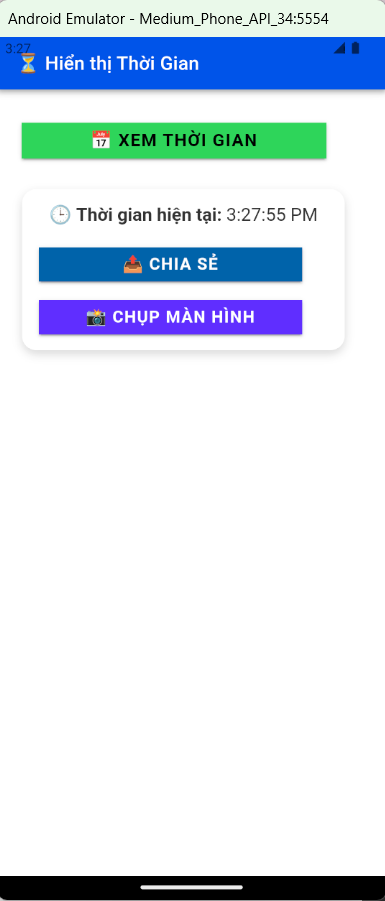
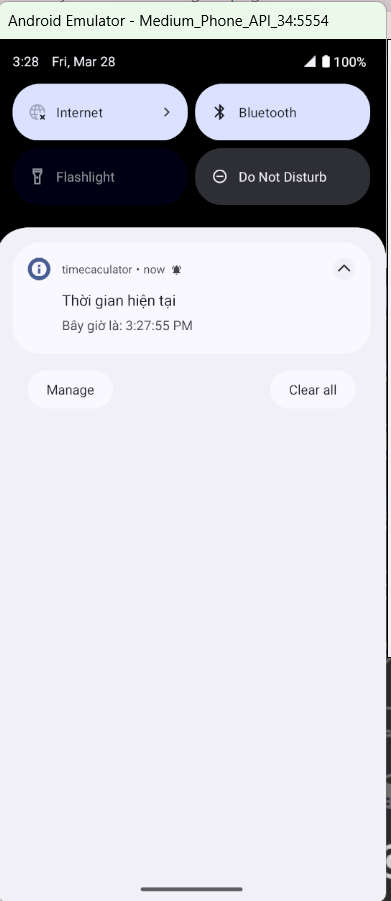
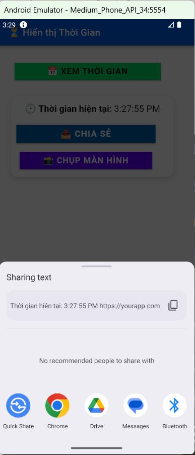
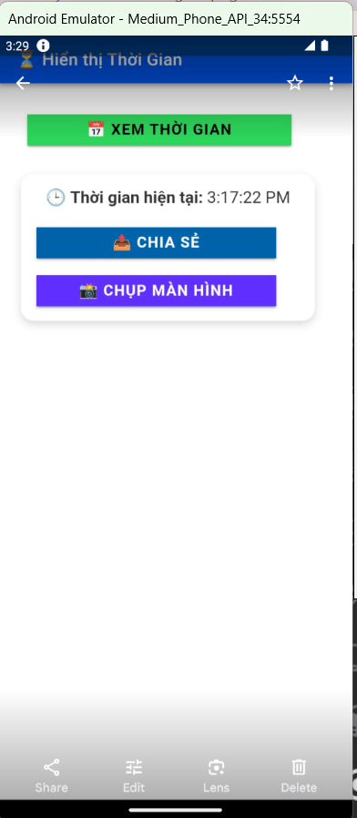
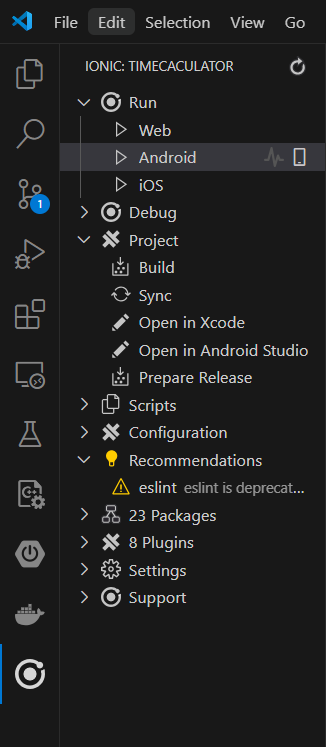

# Project Title
# Xây dựng ứng dụng đơn giản sử dụng Capacitor để hiển thị thời gian hiện tại của người dùng.

## Cài đặt

### Môi trường yêu cầu:
- *Node* phiên bản v20.19.0
- *Java* phiên bản 21.0.5
- *IDE*: VS Code
- *Cài đặt extension Ionic trên VS Code*

### Các bước:
1. Cài đặt *Ionic extension* trên VS Code.
2. Chuyển đến phần *extension Ionic*, bấm vào *Build*.
3. Sau khi build xong, bấm vào *Run trên Android*.

---

## Sử dụng

### Giao diện ứng dụng:

- Ứng dụng có:
  + Tiêu đề ứng dụng ("Hiển thị thời gian").
  + Một nút bấm để hiển thị thời gian hiện tại.
  + Kết quả hiển thị giờ, phút, giây tại thời điểm nhấn nút.

### Thông báo trong ứng dụng:

Sau khi click "Xem thời gian", ứng dụng sẽ hiển thị thông báo ngay lập tức.

### Chia sẻ thông tin:

Có thể chia sẻ kết quả qua các nền tảng khác.

### Chụp màn hình ứng dụng:

Click vào "Chụp màn hình" để chụp ảnh màn hình ứng dụng.

### Chạy ứng dụng:

Click vào build , sau khi build thành công thì click vào run trên android và chọn thiết bị để run.

---

## Ghi chú:
Đảm bảo đã cài đặt đầy đủ các môi trường cần thiết trước khi chạy ứng dụng.

- Nếu gặp lỗi, kiểm tra lại phiên bản của *Node.js*, *Java*, và *VS Code Extensions*.
